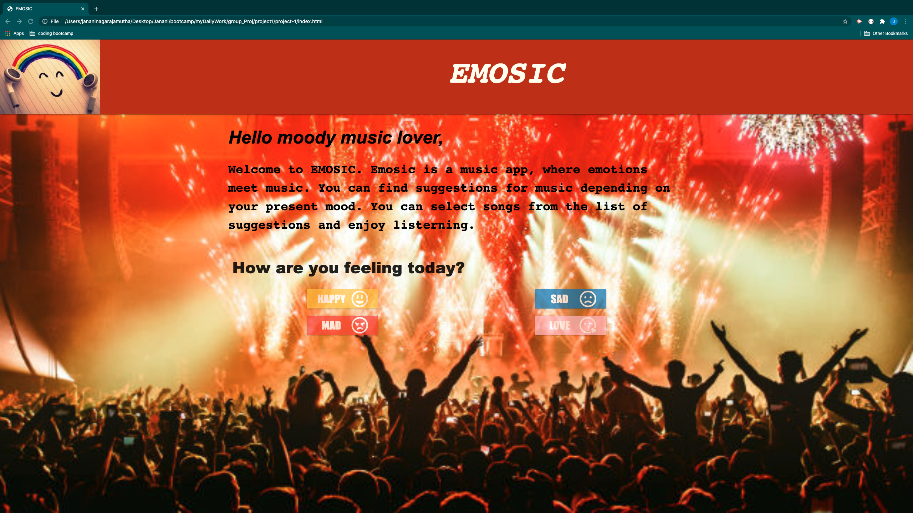
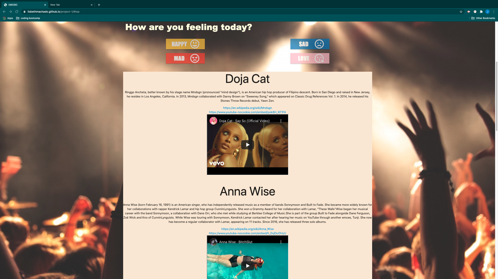
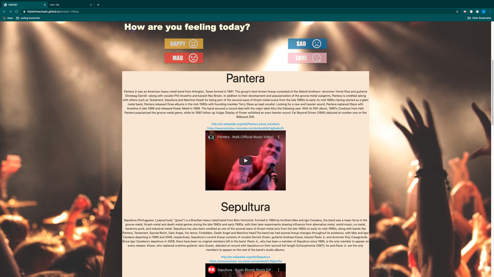

# EMOSIC - A music app

## Description 

This repository consists of code that creates a music app called "EMOSIC". This project is developed by a team of 4 front end developers, through agile software development.

This music app allows the user to choose a button (Happy, Sad, Mad, Love) depending on their mood and displays song suggestions depending upon user's choice.

The project uses an HTML page for user interface, materialize and CSS for styling the HTML and to include mobile responsiveness. The application uses jQuery to implement the logic. AJAX calls is made to connect to "Taste Drive", a third-party API. Font awesome is used to include icons in the page.

Git is used for version controlling and for periodic commits to Gitlab.

## User Stroy
AS a moody music lover, 
I WANT an application that provides me with music suggestions based on my mood. 
SO THAT I can better relate to my music choices. 

## Deployed Application URL
https://lisbethmachado.github.io/emosic/

## Screenshots of the application
 

 

